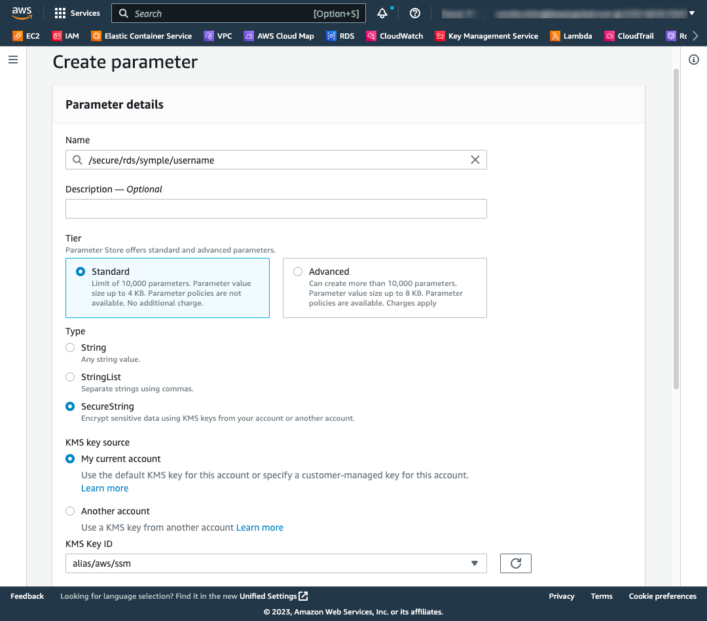
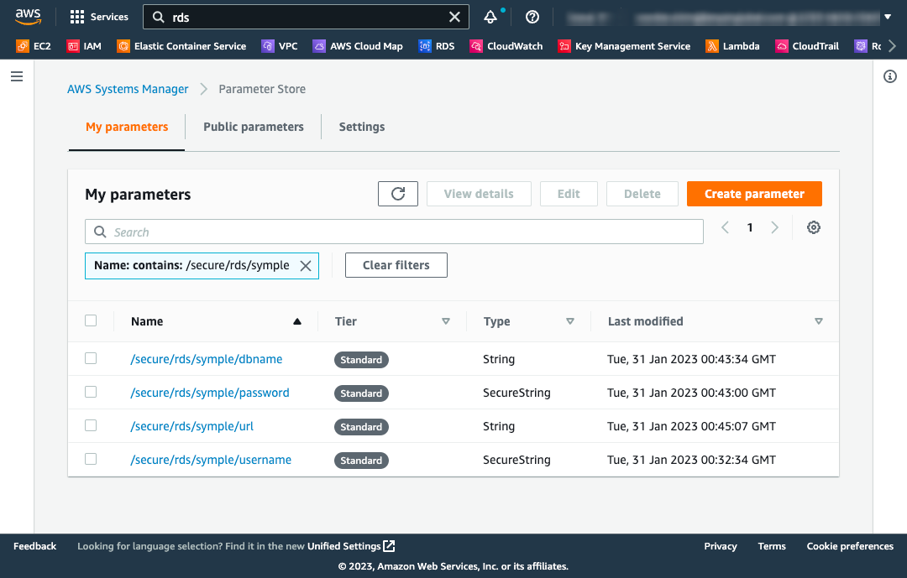

# spring-boot-starter-aws-parameter-store-demo
spring-boot-starter-aws-parameter-store 모듈을 사용하여 AWS SSM Parameter Store 를 액세스 하는 샘플 입니다. 

## What to do First?

먼저 AWS Cloud 의 SSM(Systems Manager) Parameter Store 의 경로에 암호화 할 중요한 정보를 등록 합니다.

### Register the Parameter Store 

이 예제를 위해 아래와 같이 파라미터 경로에 4개의 임의의 값을 입력 합니다.

- `/secure/rds/symple/username`
- `/secure/rds/symple/password`
- `/secure/rds/symple/dbname`
- `/secure/rds/symple/url`

<br>

등록을 위해 [AWS 관리 콘솔](https://console.aws.amazon.com/systems-manager/parameters/) 에 로그인 하고 `AWS Systems Manager > Parameter Store` 메뉴로 이동 합니다.




참고로, KMS Key ID 는 AWS 관리형 키(AWS managed keys) 인 'alias/aws/ssm' 을 선택 햇지만, 사전에 고객 관리형 키(Customer managed keys: CMK) 를 생성했다면 그 키를 선택할 수 있습니다.

<br>

아래와 같이 4개의 파라미터를 등록 하였습니다.



## Application Properties

spring-boot 의 [application-properties](https://docs.spring.io/spring-boot/docs/current/reference/html/application-properties.html) 설정 방식과 동일 하게 설정 합니다.

`application.yaml` 또는 `application.properties` 설정 파일에 아래와 같이 AWS Parameter Store 를 액세스 할 수 있도록 "spring.cloud.aws.ssm.provider-type" 속성을 설정 합니다.

### Local Test

로컬 테스트 환경을 위해선 아래와 같이 "provider-type" 과 "profile" 속성을 설정 하고 AWS SSM Parameter Store 에 저장된 경로의 보안 값을 액세스 할 수 있는지 확인 할 수 있습니다.      
AWS Profile 에 관련된 설정은 AWS [Configuration and credential file settings](https://docs.aws.amazon.com/cli/latest/userguide/cli-configure-files.html) 가이드를 참고 합니다.


```
spring:
  cloud:
    aws:
      ssm:
        provider-type: profile
        profile: <your_profile>
```


### Production

Production 서비스 환경을 위해 "spring.cloud.aws.ssm.provider-type" 값을 "default" 으로 설정 합니다.

이렇게 하면, EC2, ECS, Lambda 와 같은 애플리케이션을 구현 했을 때 인증을 위해 내부적으로 [AssumeRole](https://docs.aws.amazon.com/STS/latest/APIReference/API_AssumeRole.html) 을 사용 하게 되고,
[DefaultCredentialsProvider](https://sdk.amazonaws.com/java/api/latest/software/amazon/awssdk/auth/credentials/DefaultCredentialsProvider.html) 을 통해 자동적으로 인증 할 뿐만 아니라 소스 코드 에서 accessKey 가 노출 되지 않고 안전 하게 액세스 할 수 있습니다.

```
spring:
  cloud:
    aws:
      ssm:
        provider-type: default
```

<br>

## Test
SsmParameterValueAnnotationTests 테스트가 통과하는지 확인 합니다. 

```
gradle clean test --tests 'io.github.simplyexample.demo.ssm.SsmParameterValueAnnotationTests' 
```

